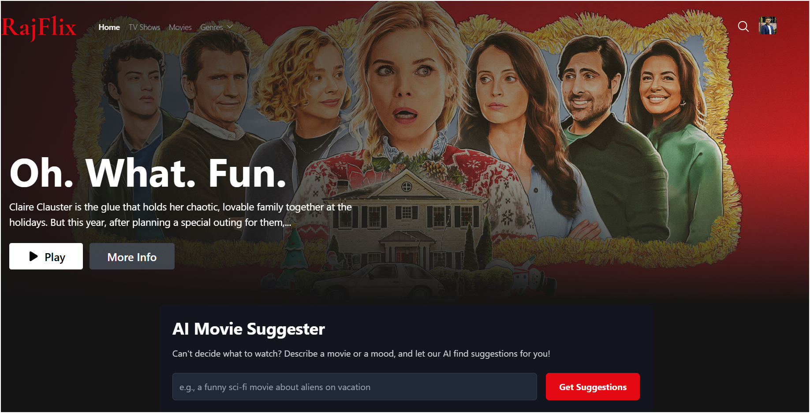
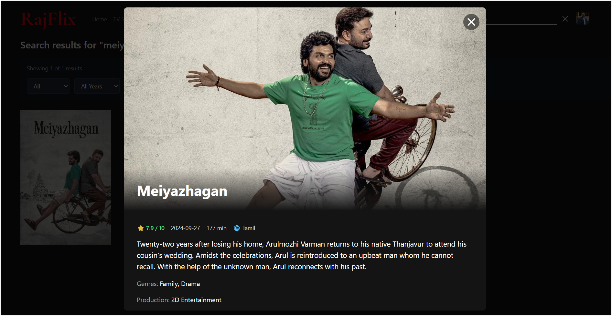
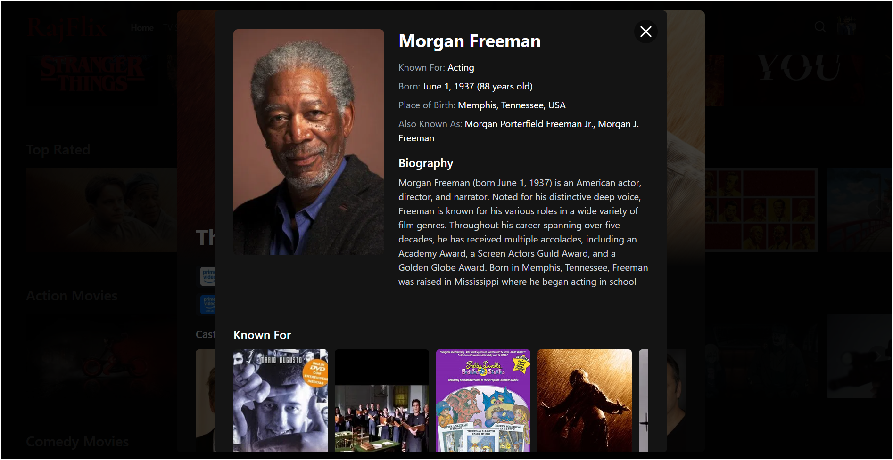
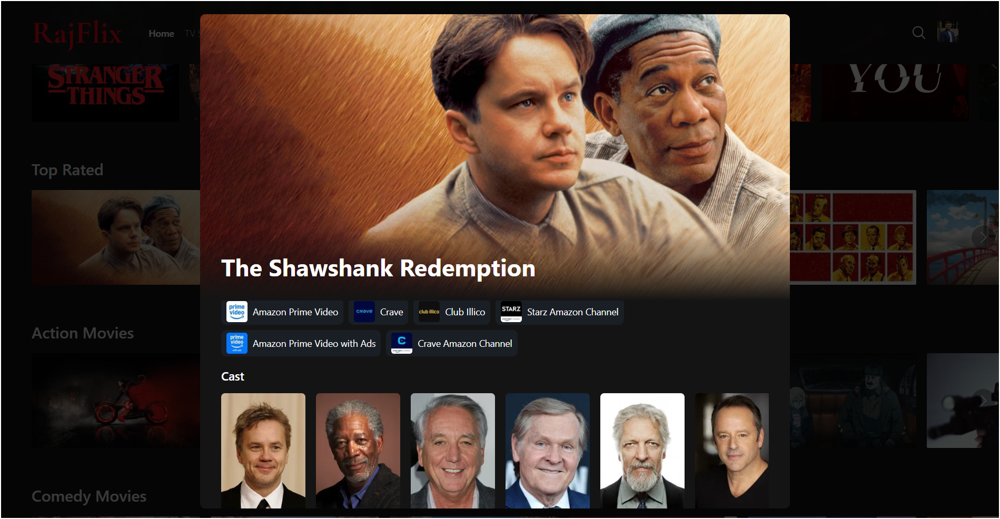
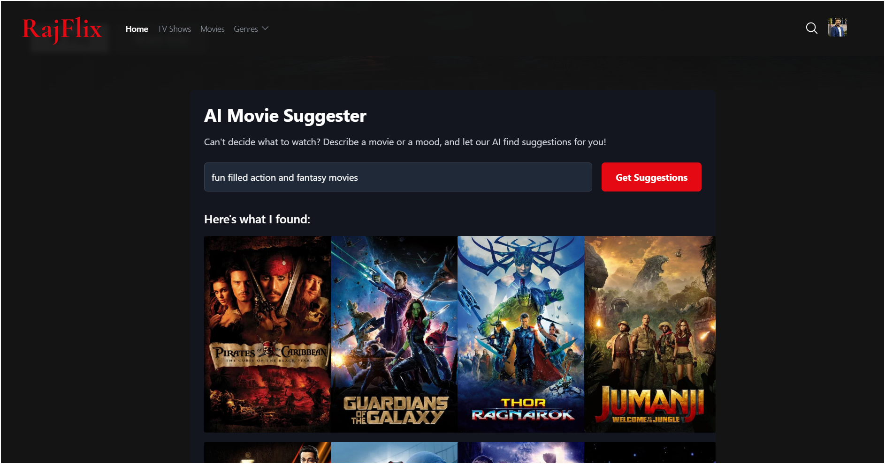
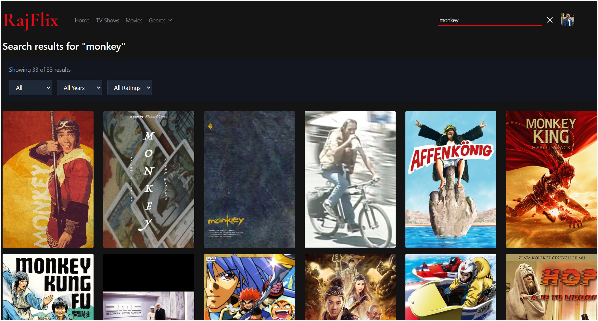
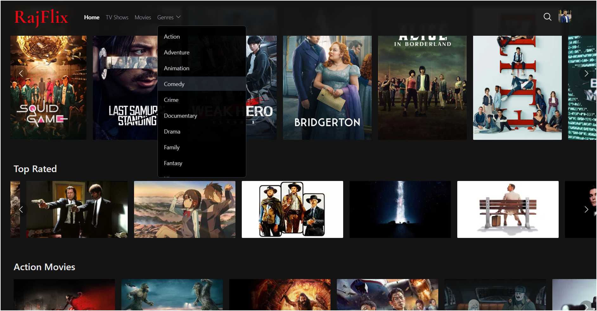
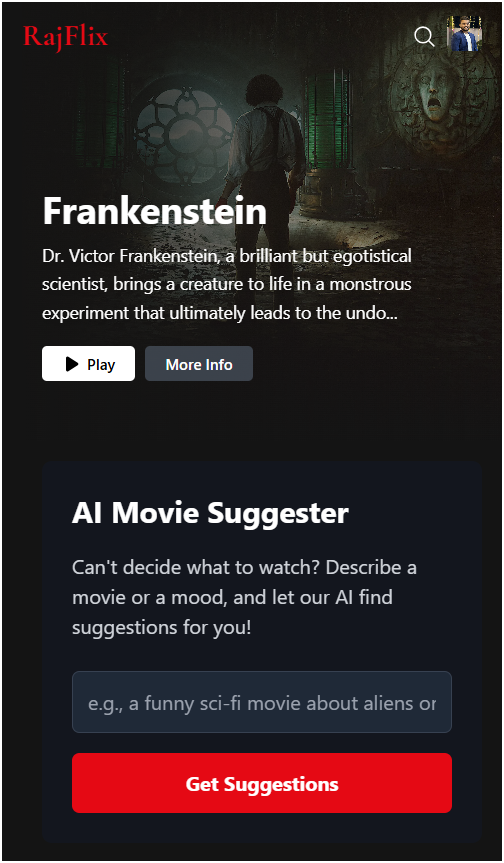
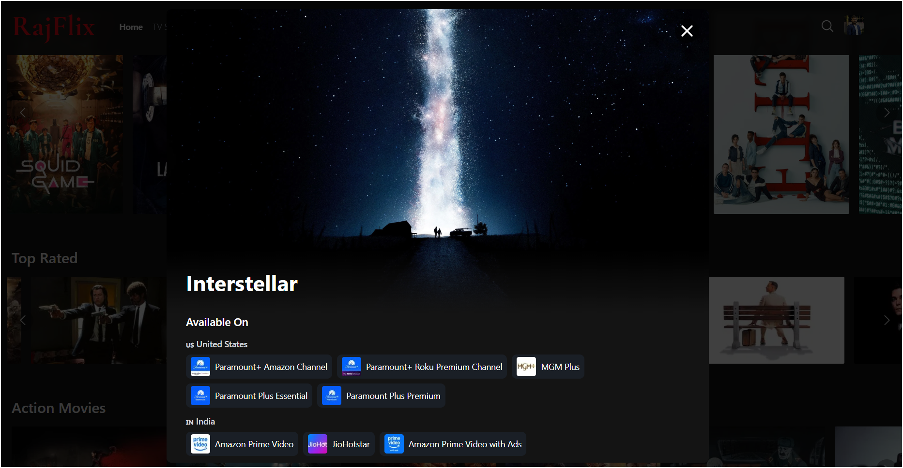

<div align="center">
  
</div>

<br/>

# 🎬 RajFlix - AI-Powered Movie & Tv Shows search inventory Application

A modern, Netflix-inspired movie and TV show browsing application powered by AI. Built with React, TypeScript, and Vite, RajFlix provides an intuitive interface to discover trending content, search for your favorites, and get personalized recommendations using Google's Gemini AI.

## ✨ Features

### 🎬 Content Browsing
- **Trending Content**: Discover what's popular right now across movies and TV shows
- **Multiple Categories**: Browse by genre with 27+ genres including Action, Comedy, Horror, Sci-Fi, Romance, and more
- **Separate Views**: Dedicated sections for Movies and TV Shows
- **Netflix Originals**: Special section featuring Netflix exclusive content
- **Genre Filtering**: Filter content by media type (Movies/TV), year (1990s-2024), and ratings (6-9+)

### 🔍 Advanced Search
- **Smart Search Algorithm**: Intelligent search with multi-page results and relevance ranking
- **Search Filters**: Filter results by media type, year range, and minimum rating
- **Real-time Results**: Dynamic search with debouncing for optimal performance
- **Search Hints**: Helpful suggestions when no results are found

### 🤖 AI-Powered Recommendations
- **Gemini AI Integration**: Get personalized movie and TV show suggestions using Google's Gemini AI
- **Natural Language Input**: Describe what you want to watch in your own words
- **Smart Suggestions**: AI analyzes your preferences and recommends up to 10 titles
- **Interactive Cards**: Click any AI suggestion to view full details

### 🎭 Detailed Information
- **Comprehensive Movie/Show Details**: 
  - Synopsis and overview
  - Cast members with photos and character names
  - Release dates and runtime/seasons
  - Languages (original and available)
  - Production companies
  - User ratings and status
- **Streaming Availability**: See where content is available to watch in US, India, UK, and Canada with OTT platform logos
- **Cast Profiles**: Click on any cast member to view:
  - Full biography and personal information
  - Filmography with top 10 known works
  - Age, birthplace, and alternate names
  - Profile photos

### 🎨 Modern User Interface
- **Netflix-Inspired Design**: Sleek, dark theme with smooth animations
- **Hover Effects**: Interactive cards with scale and highlight effects
- **Hidden Scrollbars**: Clean, modern scrolling without visible scrollbars
- **Arrow Navigation**: Netflix-style left/right arrow buttons for content rows
- **Responsive Banner**: Dynamic hero section featuring random trending content
- **Smooth Transitions**: Fade-in animations and seamless page transitions

### 📱 Fully Responsive
- **Mobile Optimized**: Touch-friendly interface with proper sizing for mobile devices
- **Tablet Support**: Adaptive layouts for medium-sized screens
- **Desktop Experience**: Full-featured experience with hover interactions
- **Flexible Grid Layouts**: Content adapts to screen size automatically
- **Touch Gestures**: Swipe-friendly scrolling on mobile devices

### ⚡ Performance Optimized
- **Lazy Loading**: Images load on-demand for faster page loads
- **Request Timeouts**: 8-10 second timeouts prevent hanging on slow connections
- **Error Handling**: Graceful fallbacks when API requests fail
- **Loading States**: Spinner animations during data fetching
- **Image Optimization**: Multiple image sizes for different contexts
- **Debounced Search**: Optimized search to reduce unnecessary API calls

### 🎯 Additional Features
- **Profile Menu**: Personalized user profile with custom avatar
- **About Modal**: Information about the application
- **Direct Navigation**: Quick access to Movies, TV Shows, and Home sections
- **Keyboard Accessible**: Full keyboard navigation support with aria-labels
- **Deep Linking**: Navigate from cast to movies and back seamlessly

## 📸 Screenshots

### Home Page


*Browse trending movies and TV shows with the Netflix-inspired interface*

### Movie Details


*Comprehensive movie information including cast, streaming platforms, and ratings*

### Cast Profile



*Detailed cast member information with biography and filmography*

### AI Suggestions


*Get personalized recommendations using Google Gemini AI*

### Search Results


*Smart search with filtering options by type, year, and rating*

### Genre Filtering


*Browse content by genre with advanced filters*

### Mobile View


*Fully responsive design optimized for mobile devices*

### Streaming Platforms


*See where to watch with streaming platform availability*


## 🛠️ Technologies Used

- **React 19.2.1** - Modern UI library
- **TypeScript** - Type-safe JavaScript
- **Vite** - Fast build tool and development server
- **Google Gemini AI** - AI-powered movie suggestions
- **TMDB API** - Movie and TV show data
- **CSS3** - Styling and animations

## 📋 Prerequisites

- **Node.js** (v16 or higher)
- **TMDB API Key** (free from [themoviedb.org](https://www.themoviedb.org/settings/api))
- **Google Gemini API Key** (free from [Google AI Studio](https://aistudio.google.com/app/apikey))

## 🚀 Local Development

1. **Clone the repository**
   ```bash
   git clone https://github.com/Rajkumar-21/RajFlix.git
   cd RajFlix
   ```

2. **Install dependencies**
   ```bash
   npm install
   ```

3. **Configure API Keys**
   
   Create a `.env.local` file in the root directory:
   ```env
   GEMINI_API_KEY=your_gemini_api_key_here
   ```

4. **Run the development server**
   ```bash
   npm run dev
   ```

5. **Open your browser**
   
   Navigate to `http://localhost:3000`

## 🔧 Build for Production

```bash
npm run build
npm run preview
```

## 🌐 Deployment to GitHub Pages

This project is configured to automatically deploy to GitHub Pages via GitHub Actions.

### Setup GitHub Secrets

1. Go to your repository on GitHub
2. Navigate to **Settings** → **Secrets and variables** → **Actions**
3. Click **New repository secret**
4. Add the following secret:
   - **Name**: `GEMINI_API_KEY`
   - **Value**: Your Google Gemini API key

### Automatic Deployment

The app automatically deploys to GitHub Pages when you:
- Push to the `main` branch
- Manually trigger the workflow from the Actions tab

Your app will be available at: `https://rajkumar-21.github.io/RajFlix/`

### Manual Deployment Trigger

1. Go to the **Actions** tab in your repository
2. Select the **Deploy to GitHub Pages** workflow
3. Click **Run workflow**

## 📁 Project Structure

```
RajFlix/
├── components/           # React components
│   ├── AboutModal.tsx    # About information modal
│   ├── AiSuggester.tsx   # AI-powered movie suggestions
│   ├── ApiKeyModal.tsx   # API key configuration
│   ├── Banner.tsx        # Hero banner component
│   ├── Header.tsx        # Navigation header
│   ├── Loader.tsx        # Loading spinner
│   ├── MovieCard.tsx     # Movie/TV show card
│   ├── MovieModal.tsx    # Movie details modal
│   ├── Row.tsx           # Horizontal content row
│   └── SearchResults.tsx # Search results display
├── services/             # API services
│   ├── geminiService.ts  # Google Gemini AI integration
│   └── tmdbService.ts    # TMDB API integration
├── App.tsx               # Main application component
├── index.tsx             # Application entry point
├── types.ts              # TypeScript type definitions
├── vite.config.ts        # Vite configuration
└── package.json          # Project dependencies

```

## 🔑 API Keys

This application requires two API keys:

1. **TMDB API Key**: Used for fetching movie and TV show data
   - Get it from: [themoviedb.org/settings/api](https://www.themoviedb.org/settings/api)
   - Note: The TMDB key is currently hardcoded in `tmdbService.ts`

2. **Google Gemini API Key**: Used for AI-powered movie suggestions
   - Get it from: [Google AI Studio](https://aistudio.google.com/app/apikey)
   - Set as `GEMINI_API_KEY` environment variable

## 🤝 Contributing

Contributions, issues, and feature requests are welcome! Feel free to check the [issues page](https://github.com/Rajkumar-21/RajFlix/issues).

## 📝 License

This project is [MIT](LICENSE) licensed.

## 👨‍💻 Author

**Rajkumar**
- GitHub: [@Rajkumar-21](https://github.com/Rajkumar-21)

## 🙏 Acknowledgments

- [TMDB](https://www.themoviedb.org/) for providing the movie database API
- [Google Gemini AI](https://ai.google.dev/) for AI-powered suggestions
- Inspired by Netflix's UI/UX design

---

Made with ❤️ by Rajkumar
